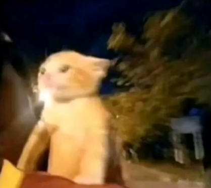
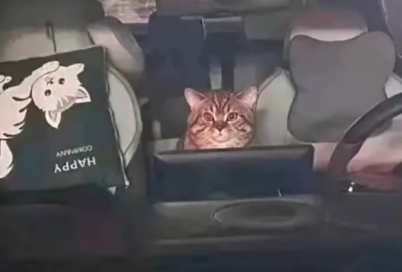
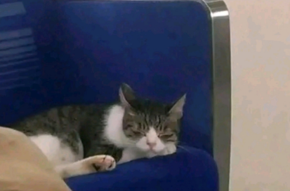
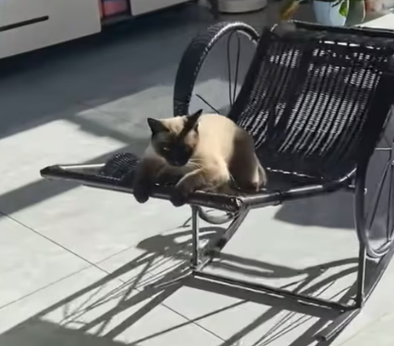
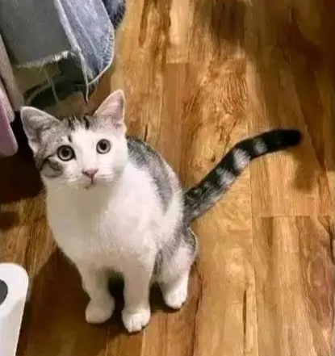
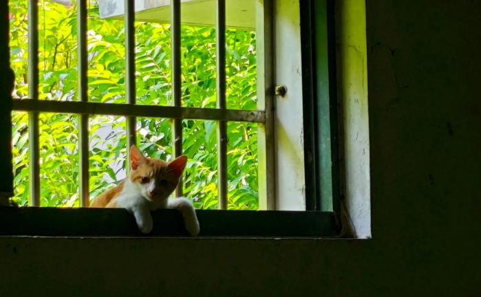

+++
title = '猫猫文学'
date = 2024-01-19
draft = false
description  = ''
categories = ['故事']
tags = ['猫']

+++

下面都是网上找的文章

姜黄色的猫是突然决定要走的，没有什么预兆，它那天下班还在罗森便利店买了一串鸡脆骨，一个饭团，这时个摩的佬呼地刹在它面前，问:靓仔，坐摩的吗。姜黄色的猫突然决定要走，它说坐吧。摩的佬问它，去哪里。猫说:我要回家，回有那个有斑斑驳驳的墙，有大杨树的树影子，有歌谣和星星的家。摩的佬说:五块走不走。猫说:行。姜黄色的猫站在车上，风把它的毛和耳朵吹翻过去，它哦吼吼地唱起了歌:就是这样，我骑着风神125，辞别这个哮喘的都市。管它什么景气什么前途啊，我不在乎。

---

蒜泥猫跑车已经几年了，但是没攒下一分钱规矩就是这样定的，猫司机的收入只有人类的30%。那天晚上蒜泥猫突然不想再跑了，他把车停在路边看着远方灯火发呆了很久，然后下车进了美宜佳便利店要了三个他最爱的金枪鱼罐头。结完账的时候蒜泥猫突然问店员“你知道英国在哪吗?大家都说我是英国猫。”店员头也没抬淡淡答道在西方。”蒜泥猫看了一眼手机上的余额然后回到车上驾驶着他的汽车向西开去。还有七百多块钱，够加两箱油，希望英国不会太远”蒜泥猫说，“况且我还有三个金枪鱼罐头。

---

南方的猫总算是能走了，他这次只背上一个显眼的旅行包，和两袋鲜虾鱼板面，头也不回地走了。北方的朔风从桥上掠过其他猫应该都在壁炉旁睡着了吧。夜色渐渐笼罩华北平原，这大都市似乎容不下渺小的他。他跳到列车座椅上，放好了行李，接着合上眼“再睁眼肯定就离开这了”他这样想。

---

暹罗车夫猫今天休息，但是车夫猫猫们照例是不休息的。车夫猫辛苦，平时在街上用他矮小的身板拉客，比人类多挣一份可爱钱。一趟又一趟地今天他终于攒够了钱，买了一辆自己的新车!可是每天拉客，成了车夫猫的习惯，他踱来踱去，怎么也歇不住，便在屋子里拉着车，原地转圈。直到肚子饿了，嘴巴馋了，才想起来要用剩下的零钱去买早就盯上的冻干--他终于可以享受一下了。

---

终于回家了，猫在门口等我，我放下行李就冲过去抱住他，猫把我推开说:你出去玩了那么多天，有给我带礼物吗?我尴尬的笑了笑，借口去厕所的时间赶紧去柜子里拿了个罐头给猫，我说:这是我从长沙带回来的罐头。我知道猫不识字，看不出来的，问他:现在要打开吃掉吗?猫摇了摇头说:这个罐头有纪念意义，我要留着。后来偷看猫的日记:我不敢吃那个罐头，我怕味道和柜子里的一样...

---

灰猫有一顶橘色的帽子，是灰猫用捡来的橘子皮做的很小心地掏了两个洞露出耳朵，在它脑袋上忠实地散发着橘子的气味。灰猫戴着橘子皮帽子走在街上，心里美滋滋的。而街上的人都笑话它，有的人说猫怎么能戴帽子，有的人说橘子皮怎么能当帽子用。也有的人告诉灰猫不要在意别人的看法。灰猫掉转头回了家，坐在椅子上自言自语说:“不在意别人的看法是很酷”。灰猫说。然后摘掉，可是在意别人的看法，也不是什么过错啊。帽子拿在手里看了好一会，昂昂地哭了起来。

---
  

嘿，我可真羡慕你，猫趴在窗口对我说，我们猫一天到晚风里来雨里去，讨口子讨不到二斤面，你倒好，吹不着晒不到，三餐都有人送上门我苦笑着告诉猫这叫牢房，猫却骂我身在福中不知福，生活是乏味可陈之物堆彻的高墙，猫想进来，我想出去。

