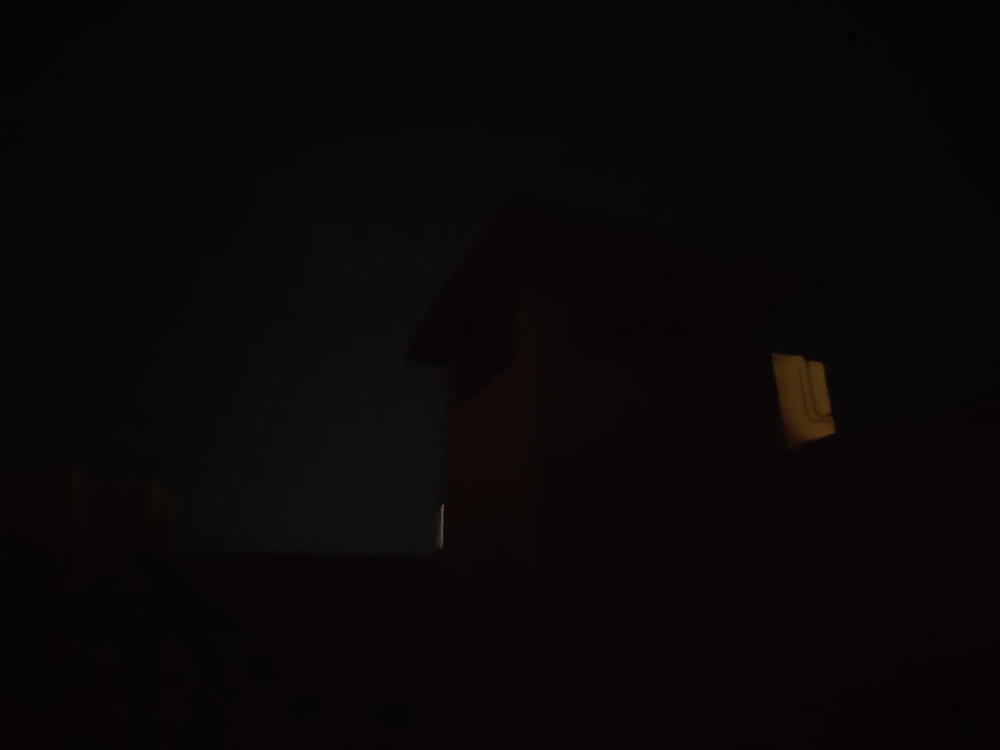

+++
title = '石板'
date = 2024-09-02
draft = false
description  = ''
categories = ['故事']

+++

这是我的好朋友，石板，他人很好，每次我来天台的时候他都在这里陪着我，每次我还没有来他就在这里等着我了，从不违约。他陪伴我这么久我居然今天才发觉，每天坐或站在他身上，他也从不埋怨，我说的许多自言自语，胡言乱语的话他也愿意静静聆听，就有一点不好就是他从不给我说说他的故事，我想听听他的故事，从哪座山，那条河出生的？又是被谁开采，又是怎么来到这里的？他从没给我说过。

今天我才真正的察觉到，他真是我的好朋友，刚才给他说了悄悄话，问了他饿吗？冷吗？但是他还是没有回应我。我又给他唱了首歌，也没回应我，但我知道，他还是喜欢我，因为每次他都在这里等着我，无论风雨。

刚才我躺到天台上，之前从未有过，为什么不呢？我睁开眼就能看到星星，腰带有些硌人，于是我就解开了裤腰带，我还在想要是这时候上来人会觉得我在干嘛，管他呢，实话说并不舒服，要是有个枕头的话还凑合，我和石板躺在一起，哈哈哈头一次和他躺在一起。

晚安石板，即使这次又没回应我。
