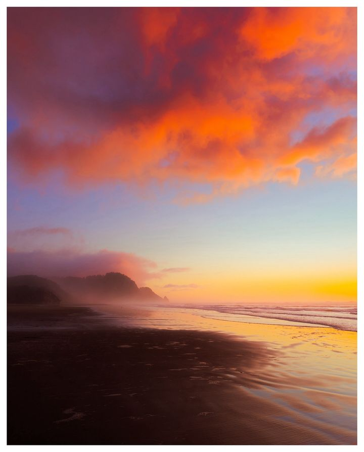
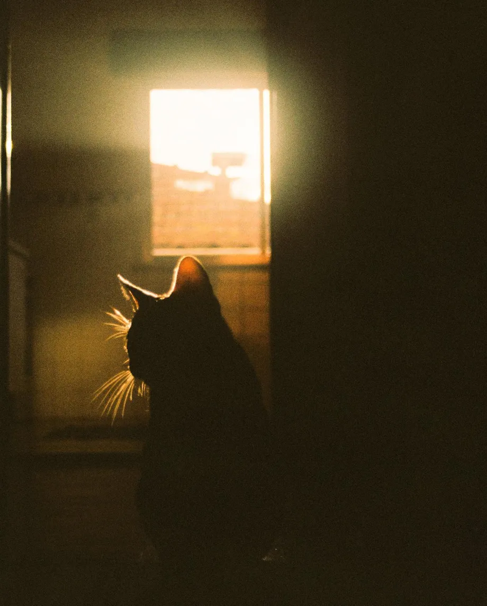

+++
title = '海和夕阳，我和猫'
date = 2024-04-12
draft = false
description  = ''

+++

虽然已经见过很多次了，仍愿意再次为它驻足。

虽然已经见过很多次了，那再看一次又何妨呢？

当我真正的站在这里时，才知道有些东西是屏幕所传递不了的，抬起头，漫天的，一片反重力的橘红色的海向我扑来，海风裹挟着海浪拍打岸边的声音抚摸着我的耳朵，内心一种原始的冲动不止一次的想要呼喊出来，一时间竟退化成只会使用哇，啊，和肢体动作来表达情感。忘记了所有词语，忘记了所有造句手法，甚至忘记了呼吸，脱口而出的只有一句：“我操！真他妈好看!”。但这相对于那些精妙的句子是对它有着更高的赞赏吧。

此刻思绪万千，却发不出一点声响，静静的享受着，橘黄色的光线照在沙滩和我身上，直视阳光也并没有那么刺眼，淡淡的海水味空气如此清新，我忍不住大口呼吸，再多待会吧，待到天空变蓝，待到夜幕降临。

虽然已经见过很多次了，但每次看到它都如第一次见到时那般激动。

虽然已经见过很多次了，却仍依依不舍，期待着下次相遇快点到来。

Alex Hinson.

---

如果可以的话我想有一间一面窗户朝西的屋子，和一只粘人的猫，等到傍晚的时候可以躺在沙发上抱着猫，一点点看着夕阳把我的影子拉长，然后度过一个充实又虚无的一天。

Sara Latif